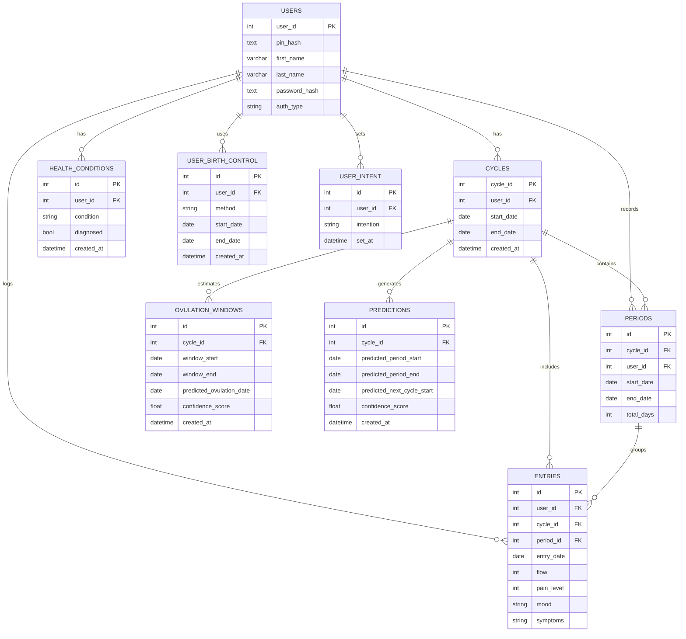

**SCHEMA DRAFT**

_Just a draft of how we could split up all the information we need from users, there are definitely ways to cut it down but we may need most of this information, if not more, for accuracy in the prediction algorithm._

_Key Changes:_
* Cycle is the parent container for one menstrual cycle window.
* Periods are linked explicitly to cycles with cycle_id (no date-only matching).
* Entries include user_id and cycle_id for ownership and analytics.
* Entries keep period_id optional because not all logs occur during bleeding days.
* user_id is kept even for local-first usage to support future sync and multi-account.
* SQL examples are standardized to SQLite-style types and keys for consistency.

**Visual Relationship Model**
```
User
|- Health Conditions
|- Intent
|- Birth Control History (time ranges)
|- Cycles
|    |- Periods
|    |- Ovulation Windows
|    \_ Predictions
\_ Daily Entries
    |- Flow
    |- Pain
    |- Mood
    \_ Symptoms
```

**Mermaid Database Relational Diagram (Draft Target)**
* _Note: Will need to install Mermaid Diagram Plugin_

_Note: This diagram reflects the target relational structure. Some foreign keys and tables shown above (for example `cycle_id` on `periods`/`entries`, `user_id` on `entries`, and dedicated ovulation/prediction tables) are not yet present in the SQL draft below._

---

**User Profile**

```sql

CREATE TABLE users (
    user_id INT NOT NULL,
    pin_hash TEXT,
    first_name VARCHAR,
    last_name VARCHAR,
    --date_of_birth TEXT
    password_hash TEXT,
    auth_type ENUM('Local','Google', 'etc'),
)

```


**Cycles**

```sql

CREATE TABLE cycles (
    cycle_id    INT PRIMARY KEY AUTO_INCREMENT,
    user_id     INT NOT NULL,
    start_date_ DATE NOT NULL,
    end_date    DATE,
    created_at  DATETIME,

    FOREIGN KEY (user_id) REFERENCES users(user_id)
);

```


**User Entries**

```sql

--We may have to split our tables to account for all the data needed 

 CREATE TABLE periods (
            id INTEGER PRIMARY KEY AUTOINCREMENT,
            start_date_ INTEGER NOT NULL,
            end_date INTEGER NOT NULL,
            total_days INTEGER NOT NULL
        )
      

 CREATE TABLE entries (
            id INTEGER PRIMARY KEY AUTOINCREMENT,
            date_ TEXT NOT NULL,
            flow INTEGER NOT NULL,
            painLevel INTEGER,
            period_id INTEGER,
            FOREIGN KEY (period_id) REFERENCES periods(id) ON DELETE SET NULL       
 );

```


**Health Conditions Example**


```sql

CREATE TABLE health_conditions (
    id              INT PRIMARY KEY AUTO_INCREMENT,
    user_id         INT NOT NULL,
    condition       ENUM('PCOS', 'endometriosis', 'perimenopause', 'fibroids', 'thyroid_disorder', 'other'),
    diagnosed       BOOLEAN DEFAULT FALSE,
    created_at      DATETIME DEFAULT CURRENT_TIMESTAMP,

    FOREIGN KEY (user_id) REFERENCES users(user_id)
);

```

**Birth Control Example**

```sql

CREATE TABLE user_birth_control (
    id              INT PRIMARY KEY AUTO_INCREMENT,
    user_id         INT NOT NULL,
    method          ENUM('none', 'pill', 'iud_hormonal', 'iud_copper', 'implant', 'patch', 'ring', 'condom', 'other'),
    start_date_      DATE,
    end_date        DATE,
    created_at      DATETIME DEFAULT CURRENT_TIMESTAMP,

    FOREIGN KEY (user_id) REFERENCES users(user_id)
);

```

**Intent of Use** 


```sql

CREATE TABLE user_intent (
    id              INT PRIMARY KEY AUTO_INCREMENT,
    user_id         INT NOT NULL,
    intention       ENUM('conceive', 'avoid_pregnancy', 'track_only', 'health_monitoring'),
    set_at          DATETIME DEFAULT CURRENT_TIMESTAMP,

    FOREIGN KEY (user_id) REFERENCES users(user_id)
);


```