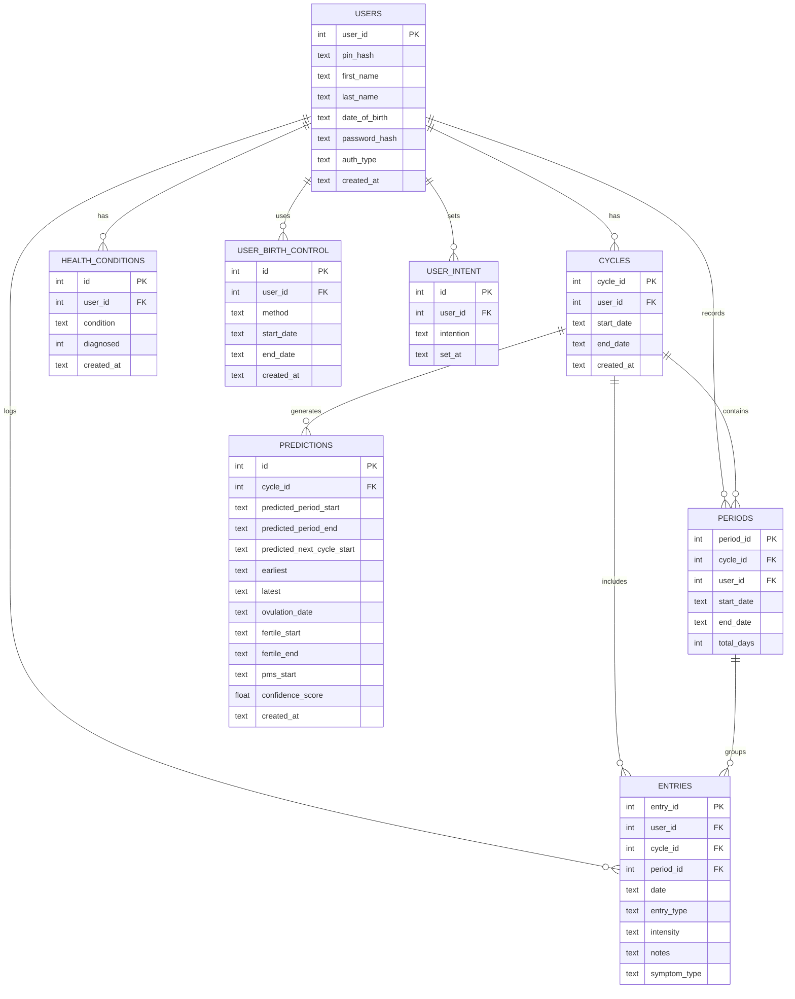

# Database Schema

_Implementation reference for the SafeCycle SQLite database. All date values are stored as ISO 8601 TEXT strings (`YYYY-MM-DD` / `YYYY-MM-DDTHH:MM:SS`). SQLite has no native date type — TEXT with ISO format is the standard pattern and is compatible with SQLite's built-in date functions (`datetime('now')`, `julianday()`, etc.)._

_Key decisions:_
* `Cycle` is the parent container for one menstrual cycle window (start of one period to start of the next).
* `Period` is the bleeding event within a cycle, linked via `cycle_id`. Keeping them separate is what allows `AVG` / `STDDEV` of cycle lengths for the prediction engine.
* `Entries` covers all daily logs (symptoms, flow, mood, etc.) and links optionally to a `period_id` since not all logs occur during bleeding days.
* `OvulationWindows` is not a separate table — ovulation date and fertile window are outputs of the same prediction calculation and are stored as columns on `Predictions`.
* `user_id` is kept on all major tables to support future multi-account or sync scenarios even though the app is currently single-user (`user_id = 1`).
* Enum-like values are enforced via SQLite `CHECK` constraints on TEXT columns.
* `created_at` columns use `DEFAULT (datetime('now'))`. `start_date` / `end_date` columns have no default — the application always provides them explicitly.

---

**Visual Relationship Model**
```
User
|- HealthConditions
|- UserIntent
|- UserBirthControl
|- Cycles
|    |- Periods
|    |- Entries
|    \_ Predictions  (includes ovulation + fertile window)
\_ Entries (non-period logs link here too)
```

---

**Entity Relationship Diagram**



---

**SQL — Full Schema**

```sql
CREATE TABLE IF NOT EXISTS Users (
    user_id       INTEGER PRIMARY KEY AUTOINCREMENT,
    pin_hash      TEXT,
    first_name    TEXT,
    last_name     TEXT,
    date_of_birth TEXT,
    password_hash TEXT,
    auth_type     TEXT NOT NULL CHECK (auth_type IN ('local', 'google', 'apple', 'other')),
    created_at    TEXT NOT NULL DEFAULT (datetime('now'))
);

CREATE TABLE IF NOT EXISTS Cycles (
    cycle_id   INTEGER PRIMARY KEY AUTOINCREMENT,
    user_id    INTEGER NOT NULL,
    start_date TEXT NOT NULL,
    end_date   TEXT,
    created_at TEXT NOT NULL DEFAULT (datetime('now')),

    FOREIGN KEY (user_id) REFERENCES Users(user_id)
);

CREATE TABLE IF NOT EXISTS Periods (
    period_id  INTEGER PRIMARY KEY AUTOINCREMENT,
    cycle_id   INTEGER NOT NULL,
    user_id    INTEGER NOT NULL,
    start_date TEXT NOT NULL,
    end_date   TEXT NOT NULL,
    total_days INTEGER NOT NULL,

    FOREIGN KEY (cycle_id) REFERENCES Cycles(cycle_id),
    FOREIGN KEY (user_id)  REFERENCES Users(user_id)
);

CREATE TABLE IF NOT EXISTS Entries (
    entry_id     INTEGER PRIMARY KEY AUTOINCREMENT,
    user_id      INTEGER NOT NULL,
    cycle_id     INTEGER NOT NULL,
    period_id    INTEGER,
    date         TEXT NOT NULL,
    entry_type   TEXT NOT NULL,
    intensity    TEXT,
    notes        TEXT,
    symptom_type TEXT,

    FOREIGN KEY (user_id)   REFERENCES Users(user_id),
    FOREIGN KEY (cycle_id)  REFERENCES Cycles(cycle_id),
    FOREIGN KEY (period_id) REFERENCES Periods(period_id)
);

CREATE TABLE IF NOT EXISTS HealthConditions (
    id         INTEGER PRIMARY KEY AUTOINCREMENT,
    user_id    INTEGER NOT NULL,
    condition  TEXT NOT NULL CHECK (condition IN ('PCOS', 'endometriosis', 'perimenopause', 'fibroids', 'thyroid_disorder', 'other')),
    diagnosed  INTEGER NOT NULL DEFAULT 0,
    created_at TEXT NOT NULL DEFAULT (datetime('now')),

    FOREIGN KEY (user_id) REFERENCES Users(user_id)
);

CREATE TABLE IF NOT EXISTS UserBirthControl (
    id         INTEGER PRIMARY KEY AUTOINCREMENT,
    user_id    INTEGER NOT NULL,
    method     TEXT NOT NULL CHECK (method IN ('none', 'pill', 'iud_hormonal', 'iud_copper', 'implant', 'patch', 'ring', 'condom', 'other')),
    start_date TEXT,
    end_date   TEXT,
    created_at TEXT NOT NULL DEFAULT (datetime('now')),

    FOREIGN KEY (user_id) REFERENCES Users(user_id)
);

CREATE TABLE IF NOT EXISTS UserIntent (
    id        INTEGER PRIMARY KEY AUTOINCREMENT,
    user_id   INTEGER NOT NULL,
    intention TEXT NOT NULL CHECK (intention IN ('conceive', 'avoid_pregnancy', 'track_only', 'health_monitoring')),
    set_at    TEXT NOT NULL DEFAULT (datetime('now')),

    FOREIGN KEY (user_id) REFERENCES Users(user_id)
);

-- Predictions stores all computed outputs in one row per cycle.
-- ovulation_date, fertile_start, fertile_end are NULL when suppressed
-- (e.g. PCOS or perimenopause — see prediction engine docs).
CREATE TABLE IF NOT EXISTS Predictions (
    id                         INTEGER PRIMARY KEY AUTOINCREMENT,
    cycle_id                   INTEGER NOT NULL,
    predicted_period_start     TEXT NOT NULL,
    predicted_period_end       TEXT NOT NULL,
    predicted_next_cycle_start TEXT NOT NULL,
    earliest                   TEXT NOT NULL,
    latest                     TEXT NOT NULL,
    ovulation_date             TEXT,
    fertile_start              TEXT,
    fertile_end                TEXT,
    pms_start                  TEXT NOT NULL,
    confidence_score           REAL NOT NULL,
    created_at                 TEXT NOT NULL DEFAULT (datetime('now')),

    FOREIGN KEY (cycle_id) REFERENCES Cycles(cycle_id)
);
```
